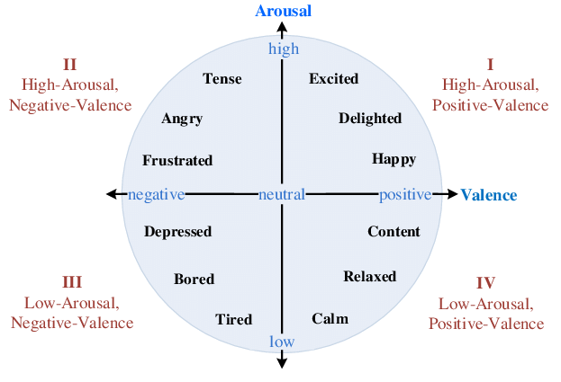
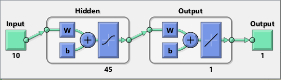
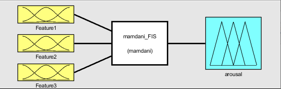
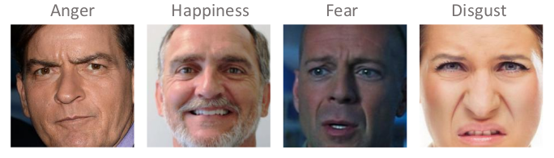
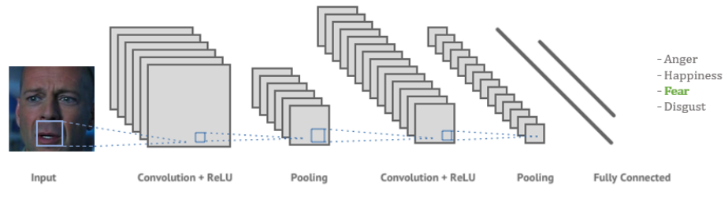
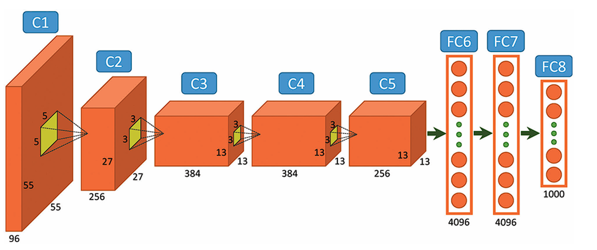
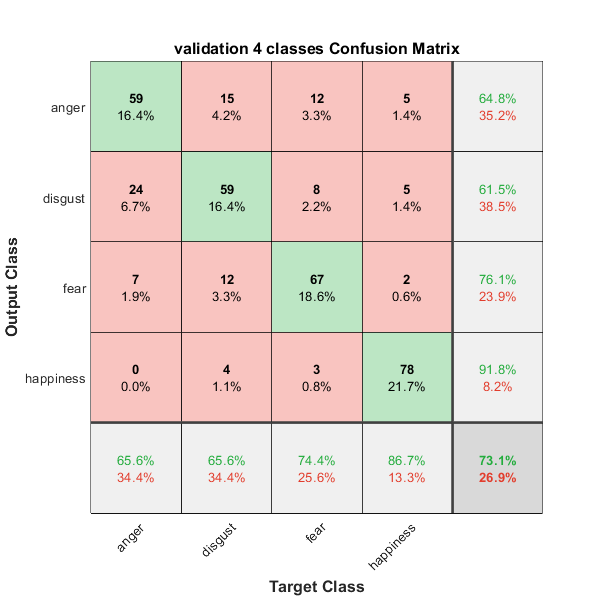
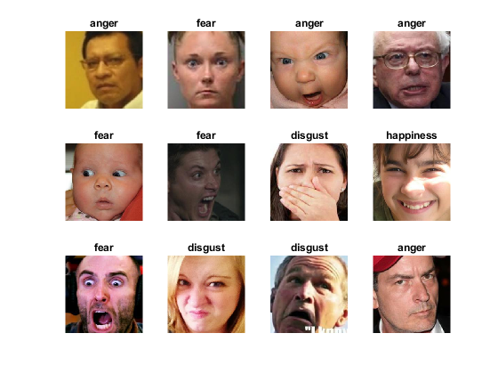

# Emotion Classification and Affective State Measure Artificial Neural Networks
**Intelligent Systems** course project (MSc in Computer Engineering @ Unversity of Pisa). Design and development of a ***Multi Layer Perceptron (MLP)***, ***Radial Basis Function (RBF)*** networks and a ***Fuzzy System*** to **estimate person's affective state**.\
Design and development of a ***CNN (Convolutional Neural Network)*** to **classify person's emotions**. Finally, **fine-tuning** of a ***Pretrained CNN (AlexNet)*** to perform the emotion classification task.
  

## Table of Contents
1. [Programming Languages and Tools](#programming-languages-and-tools)
2. [Project Description](#project-description)
    + 2.1 [Person's Affective State Measure](#persons-affective-state-measure)
    	- [Biomedical Signals Datasets](#biomedical-signals-datasets)
     	- [Estimating Valence and Arousal with MLP and RBF Neural Networks (Task 3.1)](#estimating-valence-and-arousal-with-mlp-and-rbf-neural-networks-task-31)
      	- [Mamdani-Type Fuzzy Inference System (Task 3.3)](#mamdani-type-fuzzy-inference-system-task-33)  
    + 2.2 [Facial Expression Classification ](#facial-expression-classification)
   		- [Facial Expression Datasets](#facial-expression-datasets)
		- [Classifying facial expressions with Convolutional Neural Networks (Task 4.1)](#classifying-facial-expressions-with-convolutional-neural-networks-task-41)
		- [Classifying facial expressions with a Pretrained CNN (Task 4.2)](#classifying-facial-expressions-with-a-pretrained-cnn-task-42)
 		- [Example of CNN Emotion Classification Results](#classifying-facial-expressions-with-a-pretrained-cnn-task-42) 
3. [Project Contents](#project-contents)
 

## Programming Languages and Tools

	
	 
 	

 

## Project Description

### Person's Affective State Measure
The aim of the first part of this project is to design and develop intelligent systems that measures a person’s affective state based on various biomedical signals (ECG, EEG, GSR) that are recorded by sensors.

In general, an affective state (or emotion) can be described by two terms: valence and arousal.
Valence means positive or negative affectivity, whereas arousal measures how calm or exciting the
affective state is.

An ***affective state S*** is thus described by a pair in the valence-arousal space
where the valence and arousal levels goes from 1 to 9.

	

  

#### Biomedical Signals Datasets
The types of signal recorded were:
- **Electrocardiogram (ECG)**: records the electrical activity of the heart using electrodes placed on the participant’s chest.

- **Electroencephalography (EEG)**: records the electrical activity of the brain using electrodes placed on the skin of the participant’s head.

- **Galvanic skin response (GSR)**: records the electrical conductivity of the skin using two electrodes placed on the middle and index finger phalanges (conductivity increases in proportion to a person’s sweating level).

Dataset ***dataset.mat*** contains **1591 samples**. Each sample is represented by a **set of 54 features** including **14 features extracted from the ECG**, **11 features extracted from the EEG**, and **29 features extracted from the GSR**. Each row also contains the **arousal and valence levels** in the third and fourth columns, respectively (see the project specification file for more details).
  

#### Estimating Valence and Arousal with MLP and RBF Neural Networks (Task 3.1)
Develop two multi-layer perceptron (MLP) artificial
neural networks that accurately estimate a person’s valence and arousal levels.\
The MLPs take as input a set of features and return the corresponding valence and arousal levels, respectively.

	

The second step of this part is to design and train two radial basis function (RBF) networks that do the same thing as the previously developed MLPs.
  

#### Mamdani-Type Fuzzy Inference System (Task 3.3)
One of the major problems of the ***valence/arousal model*** is that users are not familiar with these concepts. So it is very common for people to feel a certain emotion but they are unable to correctly evaluate it using valence and arousal levels.
For example, feeling fear and attributing valence and arousal levels belonging to the first quadrant of the plane means poor understanding of the model.\

The aim of this part is to design and develop a fuzzy inference system to fix the deficiencies in the arousal dimension.
The three inputs of the fuzzy system to design stem from an appropriate linguistic modeling of three features (most relevant of the datasets).
Linguistic modeling of inputs must be performed using appropriate sets of membership functions.
The output of the system is a linguistic variable that expresses the arousal based on the values of the three input features.

	

  

### Facial Expression Classification 
The purpose of the second part is the classification of emotions on the basis of images depicting faces of people with different facial expressions related to a given emotion.
  

#### Facial Expression Datasets
This dataset contains photos that show faces of people expressing different emotions. As a result of a labeling process, each image is associated with one of the following emotions: ***Anger, Happiness, Fear, Disgust***.

	

  

#### Classifying facial expressions with Convolutional Neural Networks (Task 4.1)
Design and develop a convolutional neural network (CNN) that accurately classifies a person’s emotion, based on facial expression.\
The CNN takes an image as input and returns a class that represents an emotion.

	

  

#### Classifying facial expressions with a Pretrained CNN (Task 4.2)
fine-tune a pretrained CNN to perform the task described in the previous section.
The  pretrained network used is ***AlexNet***. This network is a CNN for object recognition in images, trained with a dataset of images that contain objects belonging to 1000 classes.

	

  

#### Example of CNN Emotion Classification Results

	

	

  

## Project Contents

+ **Datasets:**
  * Dataset with ***ECG, EEG and GSR*** Biomedical Signals (Used for Tasks 3.1 and 3.3)
  * Dataset with ***Facial Expression*** Images (***Anger, Happiness, Fear and Disgust***) (Used for tasks 4.1 and 4.2)

+ **MLP (MultiLayer Perceptron) and RBF (Radial Basis Function) Neural Networks:**
  * Neural Networks used to ***estimate person's emotions*** (TASK 3.1).
  * Script for ***Data Preprocessing and Data Augmentation***

+ **Mamdani Fuzzy Inference System:**
  * ***FIS*** that fix the deficiencies of estimate person's emotions (TASK 3.3)
  * Developed with both the ***Fuzzy Logic Designer*** and ***Matlab command line***.

+ **CNN (Convolutional Neural Networks):**
  * ***Convolutional Neural Networks*** used to classify person's facial expressions (TASK 4.1 and 4.2).
  * ***2-class*** (anger and happiness) and ***4-class*** (anger,disgust, fear and happiness) classification solutions
  * CNNs used:
    * Built from scratch CNN
    * Fine-tune of a pretrained CNN (AlexNet)

+ **Project Report**

